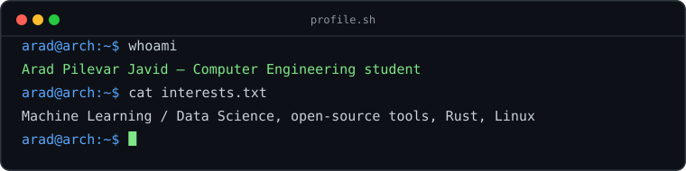
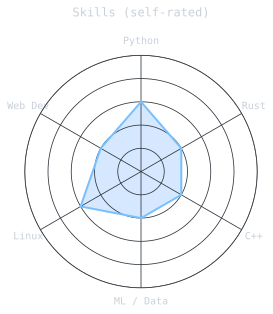
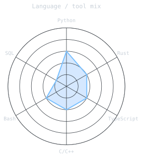

## Hello world 👋

<!-- Added: terminal-style banner. Generated by scripts/generate_banner.py from assets/banner.json.
     Edit banner.json, rerun the script (or just push — the workflow regenerates it), done. -->
<picture>
  <source media="(prefers-color-scheme: dark)" srcset="assets/banner-dark.svg">
  <source media="(prefers-color-scheme: light)" srcset="assets/banner-light.svg">
  
</picture>

 

<!-- Added: typing banner via readme-typing-svg (free, no setup needed).
     Edit the "lines" param to change what it cycles through. -->

 

<!-- Added: badge versions of the same links in "How to reach me" below -->
&nbsp;
&nbsp;

 

<!-- Added: profile view counter -->

   <!--
 
-->

### My name is Arad and I have so much fun coding and using Linux or CS in general. 😉
I am genuinely appreciative of constructive critisim and I love to learn from my mistakes. Always feel free to open an issue.

## Currently

- Studying Computer Engineering
- Learning Machine Learning and Data Science
- Building open-source developer tools
- Daily Linux user (Arch KDE)

<!-- Added: tech stack row via skillicons.dev, reflects what you've actually used -->

### Tech Stack

<!-- Added: signals - self-rated skill radar + language/tool mix radar.
     Generated by scripts/generate_radar.py from assets/skills.json and assets/langmix.json.
     Edit the ratings honestly, rerun (or push and let the workflow do it). -->

## Signals

<table border="0" cellpadding="0" cellspacing="0">
  <tr>
    <td width="50%" align="center" valign="middle">
      <picture>
        <source media="(prefers-color-scheme: dark)" srcset="assets/radar-dark.svg">
        <source media="(prefers-color-scheme: light)" srcset="assets/radar-light.svg">
        
      </picture>
    </td>
    <td width="50%" align="center" valign="middle">
      <picture>
        <source media="(prefers-color-scheme: dark)" srcset="assets/radar-langs-dark.svg">
        <source media="(prefers-color-scheme: light)" srcset="assets/radar-langs-light.svg">
        
      </picture>
    </td>
  </tr>
</table>

<tr>
  

<b><i>"Singularity is close."</i> </b>

  

## 📊 GitHub Stats

<table border="0" cellpadding="0" cellspacing="0">
  <tr>
    <td width="50%" align="center" valign="middle">
      
    </td>
    <td width="50%" align="center" valign="middle">
      
    </td>
  </tr>
</table>

 

📫 **How to reach me:**  
- 🌐 Website: [aradpilevarjavid](https://aradpilevarjavid.ir) (currently down because I haven't paid for the VPS)
- 💼 LinkedIn: [Arad Pilevar Javid](https://www.linkedin.com/in/arad-pilevar-javid) 
- 📷 Instagram: [@arad__pj](https://instagram.com/arad__pj)  

 

---
<!--
## Snake Animation
-->
<!-- 

  <picture>
    <source media="(prefers-color-scheme: dark)" srcset="github-snake-dark.svg" />
    <source media="(prefers-color-scheme: light)" srcset="github-snake.svg" />
    
  </picture>

 -->

<h3 align="center">
  
</h3>
   <!--
**AradPilevarJavid/AradPilevarJavid** is a ✨ _special_ ✨ repository because its `README.md` (this file) appears on your GitHub profile.
- 🔭 I’m currently working on ...
- 🌱 I’m currently learning ...
- 👯 I’m looking to collaborate on ...
- 🤔 I’m looking for help with ...
- 💬 Ask me about ...
- 📫 How to reach me: ...
- 😄 Pronouns: ...
- ⚡ Fun fact: ...
-->
