## Hello world 👋

### My name is Arad and I have so much fun coding and using Linux or CS in general. 😉

  

## 📊 GitHub Stats

<table border="0" cellpadding="0" cellspacing="0">
  <tr>
    <td style="border: none; padding: 0 5px 0 0;">
      
    </td>
    <td style="border: none; padding: 0 5px 0 0;">
      
    </td>
    <td style="border: none; padding: 0;">
      
    </td>
  </tr>
</table>

📫 **How to reach me:**  
- 🌐 Website: *coming soon*
- 💼 LinkedIn: [Arad Pilevar Javid](https://www.linkedin.com/in/arad-pilevar-javid) 
- 📷 Instagram: [@arad__pj](https://instagram.com/arad__pj)  

 

---
## Snake Animation

  <picture>
    <source media="(prefers-color-scheme: dark)" srcset="github-snake-dark.svg" />
    <source media="(prefers-color-scheme: light)" srcset="github-snake.svg" />
    
  </picture>

<h3 align="center">
  
</h3>
   <!--
**AradPilevarJavid/AradPilevarJavid** is a ✨ _special_ ✨ repository because its `README.md` (this file) appears on your GitHub profile.
- 🔭 I’m currently working on ...
- 🌱 I’m currently learning ...
- 👯 I’m looking to collaborate on ...
- 🤔 I’m looking for help with ...
- 💬 Ask me about ...
- 📫 How to reach me: ...
- 😄 Pronouns: ...
- ⚡ Fun fact: ...
-->
